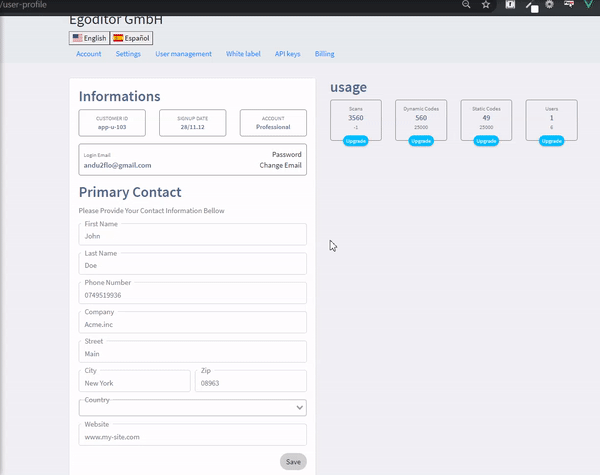

User Profile page




### Architecture
I have setup an instance of ```Vue Router``` with a route for the user profile page and one for catching url to 404 for non-existing pages.

There are separate components for the boxes on the right side.

For the form, validation is done with ```Vuelidate``` and the form cannot be submitted with errors.

The information for the User and the countries list is under ```services``` where all calls to the Api would reside.

For translations the ```vue-i18n``` library is used.


### Bugs
I could not make testing work with vue-test-utils, jest and typescript
Language could be set in url and parsed via the before hooks on vue router.
